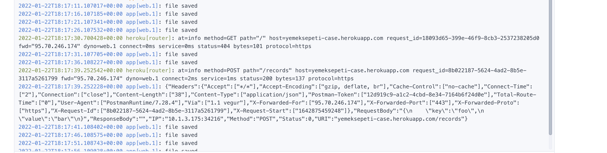

**YemekSepeti Homework**

## Intoduction
The application records the key value values sent with the http request, at the same time transfers these records to a file every 5000 ms, and continues its life by taking the records from this file when the application is closed and opened.


P.S: The file recording time parameter can be made parametric, but I didn't need it. I spent time on the topics specifically mentioned in the case content.

## Run

```
docker-compose up -d
```

## API  
* **Description:** Gets a value stored before
* **URL**
  https://yemeksepeti-case.herokuapp.com/records/{key}
* **Method:** `GET` 
 
   **Required:**
   `key`

* **Success Response:**
   * **Body:** "bar" <br />  
   * **Code:** 200 <br />  
* **Error Response:**
  * **Code:** 404 Not Found <br />

* **Sample Call:**

```curl
  curl --location --request GET 'https://yemeksepeti-case.herokuapp.com/records/foo'
```


<hr>

* **Description:** Saves a value with a key for storage
* **URL**
  https://yemeksepeti-case.herokuapp.com/records
* **Method:** `POST` 
 
   **Request Body:**
 
 ```json
 {
    "key":"foo",
    "value":"bar"
}
 ```

* **Success Response:**
   * **Code:** 200 <br />  
* **Error Response:**
  * **Code:** 400 Bad Request<br />

* **Sample Call:**
```curl
 curl --location --request GET 'https://yemeksepeti-case.herokuapp.com/records/foo2' \
--header 'Content-Type: application/json' \
--data-raw '{
    "key":"foo",
    "value":"bar"
}'
```
 
<hr>


* **Description:** Deletes all records
* **URL**
  https://yemeksepeti-case.herokuapp.com/records
* **Method:** `DELETE` 

* **Success Response:**
   * **Code:** 200 <br />  

* **Sample Call:**

```curl
  curl --location --request DELETE 'https://yemeksepeti-case.herokuapp.com/records'
```


* **Description:** Deletes specific record
* **URL**
  https://yemeksepeti-case.herokuapp.com/records/{key}
* **Method:** `DELETE` 
  
   **Required:**
   `key`

* **Success Response:**
   * **Code:** 200 <br />  

* **Sample Call:**

```curl
  curl --location --request DELETE 'https://yemeksepeti-case.herokuapp.com/records/foo'
```
<hr>


## Server Log

<center></center>


## License
```license

MIT License

Copyright (c) 2022 Ferhat Candaş

Permission is hereby granted, free of charge, to any person obtaining a copy
of this software and associated documentation files (the "Software"), to deal
in the Software without restriction, including without limitation the rights
to use, copy, modify, merge, publish, distribute, sublicense, and/or sell
copies of the Software, and to permit persons to whom the Software is
furnished to do so, subject to the following conditions:

The above copyright notice and this permission notice shall be included in all
copies or substantial portions of the Software.

THE SOFTWARE IS PROVIDED "AS IS", WITHOUT WARRANTY OF ANY KIND, EXPRESS OR
IMPLIED, INCLUDING BUT NOT LIMITED TO THE WARRANTIES OF MERCHANTABILITY,
FITNESS FOR A PARTICULAR PURPOSE AND NONINFRINGEMENT. IN NO EVENT SHALL THE
AUTHORS OR COPYRIGHT HOLDERS BE LIABLE FOR ANY CLAIM, DAMAGES OR OTHER
LIABILITY, WHETHER IN AN ACTION OF CONTRACT, TORT OR OTHERWISE, ARISING FROM,
OUT OF OR IN CONNECTION WITH THE SOFTWARE OR THE USE OR OTHER DEALINGS IN THE
SOFTWARE.
```
